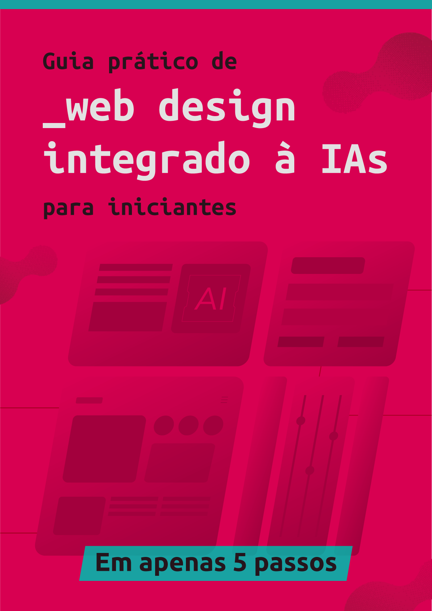

    

<a href="https://github.com/maya-franca/dio-lab-desafios-ebook/raw/main/outputs/ebook.pdf">Clique aqui para ler</a>

# E-book: Guia Prático de Web Design integrado à IAs para iniciantes

Ebook criado para um desafio das aulas do bootcamp Fundamentos de IA para Devs, da plataforma DIO em parceria com o Santander. O desafio foi criar um ebook com auxílio de IAs. 

## Ferramentas de IA utilizadas 
- ChatGPT: Geração do conteúdo de texto. 

## Outras ferramentas utilizadas (sem IA) 
- Adobe Illustrator: Desenho de capa e contracapa, edição de ilustrações do banco de imagens Freepik; 
- Adobe InDesign: Diagramação do ebook. 

## A criação 

O conteúdo em texto do e-book foi gerado pelo ChatGPT, como proposto pela aula, e depois editado e revisado. 

### Prompts utilizados 

> Sugira 10 temas para um ebook com tema de web design (incluindo front-end, back-end e design). O e-book é curto e contém no máximo 10 páginas (incluindo capa e contracapa). O conteúdo deve ser apenas introdutório sobre um assunto. 

Depois de sugerir os temas, pedi uma simulação sobre cada um deles para que eu pudesse analisar como ficaria. 

> Faça uma breve simulação de como seria o conteúdo de cada um desses itens da lista, com até 2 páginas para cada conteúdo. 

> A opção escolhida é "Introdução ao Web Design" e deve conter conteúdo de front-end, gere 20 ideias de títulos criativos com as seguintes regras: 
> 
> {REGRAS}
> O título deve conter algum adjetivo interessante e chamativo, como "intensivo", "total", "definitivo", mas não precisam ser exatamente estes adjetivos. 
> O público-alvo do e-book são iniciantes em web design, e o título deve conter alguma referência a isso. 
> Como o conteúdo do e-book é introdutório e não muito extenso, o título também deve conter alguma referência à isso. 
> O título não deve ser muito grande, deve conter até no máximo 6 palavras. 
> Alguns dos títulos podem começar com a palavra "Guia" 

> Gere o ebook com o tema "Introdução ao Web Design", com até 8 páginas de conteúdo, incluindo front-end (html, css, javascript) e um pouco de design UX/UI

> Como podemos integrar IA no desenvolvimento web/web design/front-end/full stack?

Apesar do tema do e-book sugerido pelo ChatGPT ter sido só sobre webdesign, decidi incluir o tema de IAs no e-book para encaixar com o tema das aulas. 

---

Este foi o meu projeto do desafio, espero que goste! :pink_heart:

